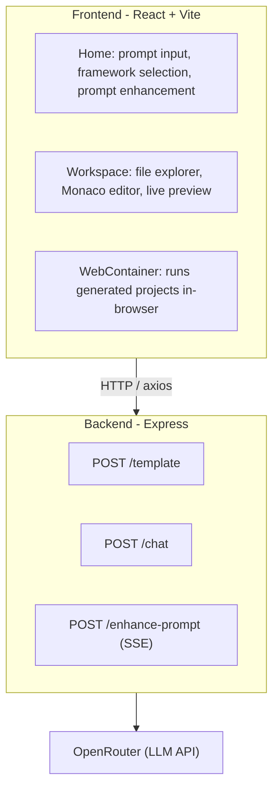

# ASKH

AI-powered web app builder. Describe what you want, the LLM generates code as XML artifacts, and the result runs live in a WebContainer-based preview.

## Architecture



## Features

- **Choose your stack** – React, Vue, Svelte, Solid (webapps), or Node.js (services)
- **Live preview** – run and see your app in the browser instantly via WebContainer
- **Checkpoints** – roll back to any previous state with content-addressable snapshots
- **Iterate with AI** – edit code or send follow-up prompts; your changes are diffed and the AI continues from there
- **Export** – download your project as a ZIP

## Libraries

| Layer    | Stack                                  |
|----------|----------------------------------------|
| Frontend | TypeScript, Vite, React, Redux Toolkit, Tailwind, Radix UI, Monaco, WebContainer API  |
| Backend  | Express, TypeScript, OpenAI SDK (OpenRouter) |
| LLM      | arcee-ai/trinity-large-preview via OpenRouter |

## Getting Started

```bash
# Backend (port 3000)
cd backend && npm install && npm run dev

# Frontend (separate terminal)
cd frontend && npm install && npm run dev
```

Set `OPENROUTER_API_KEY` and `OPENROUTER_BASE_URL` in `backend/.env`. Set `VITE_BACKEND_URL` for the frontend.
