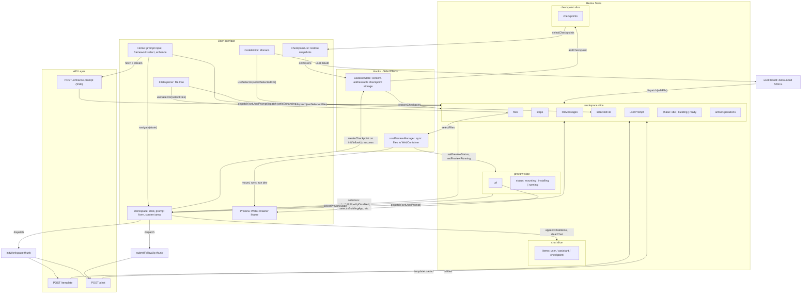

# ASKH Frontend

React app for the ASKH IDE: prompt-driven code generation with live WebContainer preview.

## Tech Stack

React, Vite, TypeScript, Tailwind CSS, Radix UI, Monaco Editor, WebContainer API, Redux Toolkit, Axios.

## Data Flow & Architecture



### Flow Summary

| User Action | Dispatch / API | State Update |
|-------------|----------------|--------------|
| Submit prompt (Home) | `navigate` with prompt + framework | Workspace mounts |
| Workspace mount | `initWorkspace` → `getTemplate` + `getChatResponse` | `files`, `steps`, `llmMessages`, `phase: ready` |
| Enhance prompt | `fetch /enhance-prompt` (SSE) | `userPrompt` streamed, `isEnhancingPrompt` |
| Submit follow-up | `submitFollowUp` → `getChatResponse` | `files`, `steps`, `llmMessages`, `userPrompt` cleared |
| Select file | `setSelectedFile` | `selectedFile` |
| Edit file (Monaco) | `editFile` (debounced 500ms) | `files`, `selectedFile.content` |
| Restore checkpoint | `restoreCheckpoint` | `files`, `steps`, `llmMessages`, `phase: ready` |
| Files change | `usePreviewManager` | `syncChangedFiles` or restart; `preview.status`, `preview.url` |

### Selectors (Derived State)

`selectIsFollowUpDisabled`, `selectIsBuildingApp`, `selectIsAppBusy`, `selectPrimaryStatusMessage`, `selectIsSubmitDisabled` — computed from `phase`, `activeOperations`, `isEnhancingPrompt`, `preview.status`.

## Scripts

```bash
npm run dev     # Vite dev server
npm run build   # Production build
npm run lint    # ESLint
```

## Environment

`VITE_BACKEND_URL` – backend API base URL (e.g. `http://localhost:3000`).
